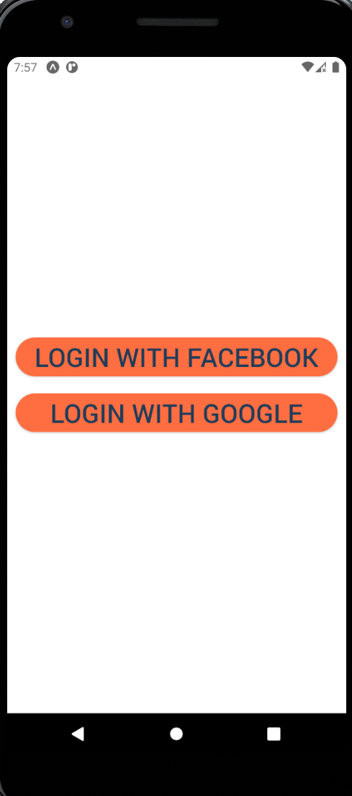
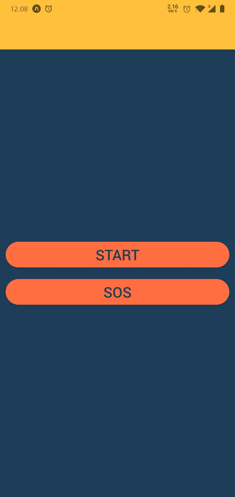
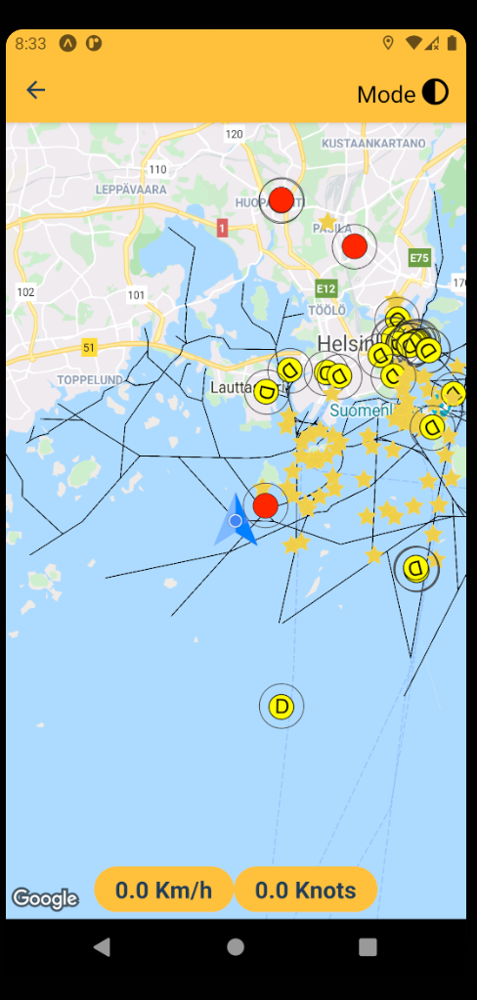
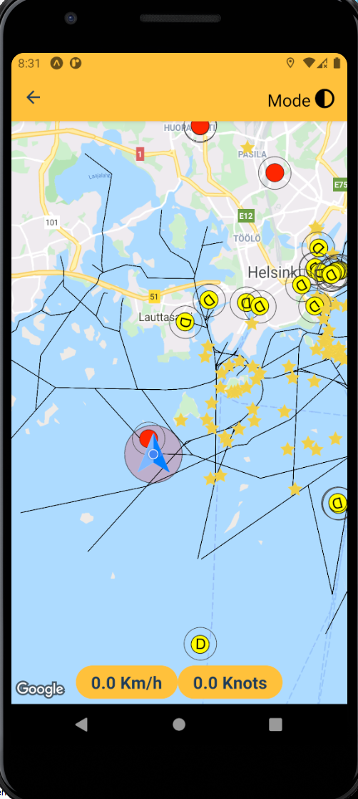
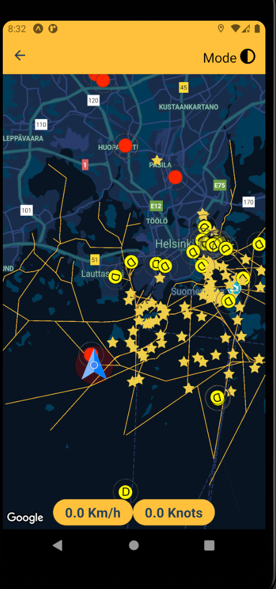

# Mobile-project (<!--strong--> **Navigation and Collision at Sea**)

Vessels - to - Vessels communication technology to minimize collisions. Smart phones turn into a V2V device and work as a sea navigator. With the help of this technology, the users are able to know nearby vessels and are notified of any possible collision with an-other boot within 900 meters. App also displays speed and weather information. Users can also send SOS calls and their location if they are in emergency. Their position will appear to other app users as a different icon on a map indicating tobe rescue.

## Technologies

1. NodeJS
1. React Native
1. Firebase
1. react-native-maps

## Feature List

### Firebase authentication

1. At the moment, login using Google and Facebook only.

### SOS

1. Make emergency call
1. Send location so that other user can know that someone need tobe rescued.


### Codebase

1. This application has been written in react native using expo-cli thus it can run on both iOS and android without changing a single line of code.
2. Clean codebase for easy modification and usage.

#### NOTE 1 :- This application has only been tested with expo client so no testing have been done for native android and iPhone.

## Prerequisite

There are a couple of things you need to install to set up the environment for React Native.

1. NodeJS
1. NPM

After installing NodeJS and NPM successfully in your system you can proceed.

## How to run?

This app has been built with [expo](https://expo.io/learn) (a wrapper for react-native). To run this app, first you need to install expo-cli on your local machine and then expo app on your phone.

###On local machine

```
npm install -g expo-cli
```

Now, clone the repo, install packages and start:

```
git clone https://github.com/MistyBui/Mobile-project.git
cd Mobile-project
npm install
npm start
```

###On Android phone
Now download the expo app from [android play store](https://play.google.com/store/apps/details?id=host.exp.exponent) or [ios app store](https://apps.apple.com/us/app/expo-client/id982107779) then open expo app on the phone. Scan the QR code from the metro bundle in http://localhost:19002, You will be able to run the app now.

## How to Build?

Be sure to update the versions (for each of Android and iOS) in app.json in the root, between build updates.

You can build the app using expo commands:

###For Android

#### Android Emulator

To run it on your Android emulator, first build your project with the apk flag by running,
```
expo build:android -t apk // for building apk.
```
and you can drag and drop the .apk into the emulator.

#### Android Device
To run it on your Android device, make sure you have the Android platform tools installed along with ``adb``, then just run
```
expo build:android -t app-bundle // for building bundle
```

These commands directly build your app but you have to create an account on expo. Also for more details regarding building for android you can follow this doc [Expo Android Build Doc](https://docs.expo.io/distribution/building-standalone-apps/#if-you-choose-to-build-for-android). This has a step by step instructions to build your app.

Once done, if you want to push to the Google PlayStore, use:

```
expo upload:android
```
with [USB debugging enabled on your device](https://developer.android.com/studio/run/device.html#device-developer-options) and the device plugged in.

###For IOS

If building with XCode, first do the following on a newly installed copy of the code, in the ios folder:

```
pod install
```

#### NOTE: In XCode, be sure to set the correct development team account:


```
expo build:ios -t archive // for app store
expo build:ios -t simulator // for simulation
```

For more details regarding building for ios you can follow this doc [Expo IOS Build Doc](https://docs.expo.io/distribution/building-standalone-apps/#if-you-choose-to-build-for-ios). This has a step by step instructions to build your app.

_Or you can directly build ios and android app from xcode and android studio directly which is same as you do for standalone app._

Once done, if you want to push to the Apple AppStore, use:

```
expo upload:ios
```

## Screenshots

 
 
 


## Demo (Expo server)

You need to download Expo client app from Google PlayStore and scan this QR code.

